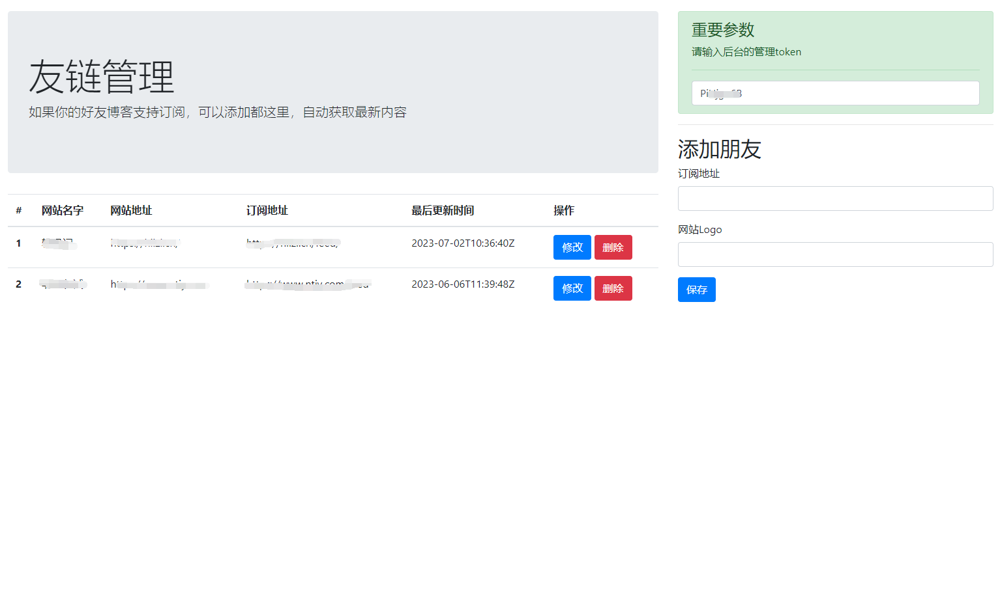
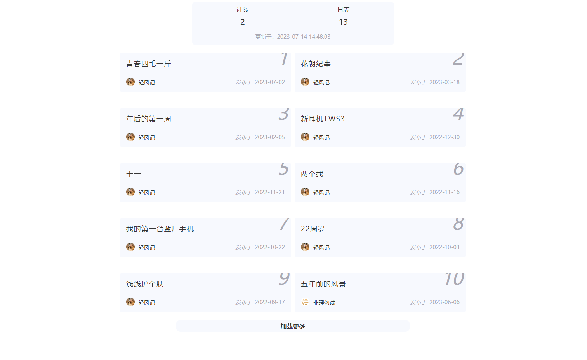

# 自动获取支持 rss 和 atom 等开放协议的博客内容订阅

## 一、需求

- 1、自己的书签里面有很多很好的博主网址，每次都要挨个去点击阅读，挺麻烦的。
- 2、拥有自己博客程序，添加了很多朋友的链接，和上一条一样，每次总得需要挨个去网站点击。
- 更多需求

## 二、如果实现

我选择用 go 语言编写一套程序，定时去获取这些支持订阅的博主网站，把更新信息缓存到数据库。
这样我们就能每天只需要查看自己数据库里面的数据，就知道哪些博主更新文章了。

## 三、一些待完善的地方

前后台展示目前只是写了一个简单的布局，因为是前后端分离的设计，所以如果你是前端高手，欢迎贡献你的力量，表示万分感谢。

## 四、声明

- 1、请控制好你的抓取速度，不要因此给你朋友服务器造成太大压力。
- 2、**此程序禁止用于非法活动，因此造成的后果自行承担。**。

## 五、部署

程序支持两种方式部署，一种是直接本地运行，一种是 docker 方式运行。

### 1、docker方式运行

我们的开源仓库地址是：https://hub.docker.com/r/liu578101804/go-friends-link

部署上没有什么特别注意的地方，只需要把配置文件 `/app/config.json` 映射到本地即可，默认程序是 `80` 端口，你可以在配置文集里面修改。

### 2、本地运行

待后续更新

## 六、其他注意事项

1、 关于定时问题

默认是每分钟爬取一次，可以在配置文件里面修改 `cron` 字段的 corn 表达式，这里提供两种配置：

- `0 35 2 * * ?`  每天凌晨2点35分执行一次
- `0 0 1 ? * L` 每周星期天凌晨1点执行一次
